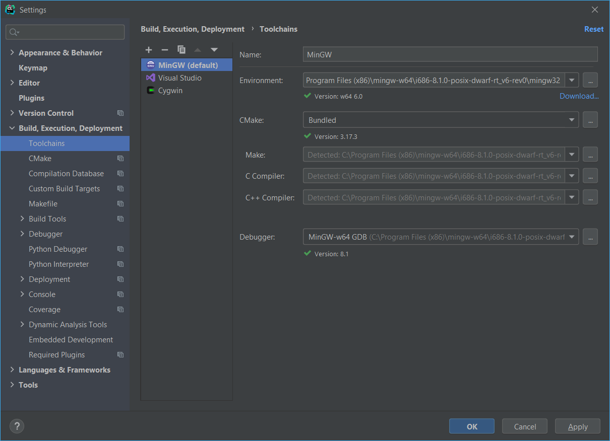

#  C++ Programming Setup 
This short guide will help you setup your development environment of choice for the upcoming semester.

## IDE vs Source Code  Editor

**Source Code Editor**: Source-code editors have features specifically designed to simplify and speed up typing of source code, such as syntax highlighting, indentation, autocomplete and brace matching functionality. These editors also provide a convenient way to run a compiler, interpreter, debugger, or other program relevant for the software-development process. So, while many text editors like Notepad can be used to edit source code, if they don't enhance, automate or ease the editing of code, they are not source-code editors. Modern Editors Support Plugins that facilitate the build and compilation of code.

 **IDE**: An integrated development environment is a software application that provides comprehensive facilities to computer programmers for software development. An IDE normally consists of at least a **source code editor**, build automation tools and a debugger.

|Recomended IDES| Recomended Editors  |
|--|--|
|<a href="https://visualstudio.microsoft.com/"> Visual Studio </a>| <a href="https://code.visualstudio.com"> VS Code </a> |
| <a href = "https://www.jetbrains.com/clion/">CLion</a>          | <a href = "https://www.sublimetext.com/">Sublime Text</a> |
| <a href="http://www.codeblocks.org"> Code::Blocks </a>| 

## Setup

### Visual Studio (Windows Only)

The most straight forward and easiest setup of all:

1. Download **Comunity version** for **Desktop** development using **C++** for **Windows**
2. Run the Visual Studio Installer
3. Select The **Desktop Development with C++** option and Install

### CLion

**DISCLAMER**: CLion is a subsription based paid IDE, however the good people from JetBrains have made it free to use for educational purposes. To get your free educational license you can register with your university e-mail (uni-sofia.bg) or ISIC card:
1. <a href="https://www.jetbrains.com/shop/eform/students">Educational License</a>
2. <a href = "https://www.jetbrains.com/clion/download/">Download CLion</a>
3. Run CLion Installer
4. <a href="https://github.com/metalfen4eto/INF-UP-20-21/blob/master/Setup.MD#download-the-c-compiler-for-your-specific-os">Install your compiler of choice and remember where you saved it</a>
5. Open a new project
6. From the Dropdown menus:
  File->Settings->Build, Execution, Deployment->Toolchains
  Add a new **MinGW** Toolchain and for the environment select the path to the compiler
  It should auto detect everything and look like this:

  

### Visual Studio Code
<a href="https://github.com/fmi-lab/up-kn-2020-group-4/blob/master/Setup.md">VS Code Setup for C++</a>

### Sublime Text
<b>Setup:</b>
1. <a href="https://github.com/metalfen4eto/INF-UP-20-21/blob/master/Setup.MD#download-the-c-compiler-for-your-specific-os">Install your compiler of choice</a>
2. Download <a href = "https://www.sublimetext.com/">Sublime Text</a>

<b>To Compile and Run:</b>
1. Open your file with Sublime
2. Click ctrl + shift + b to see the compilation options and select **C++ Single File - Run**
3. Once you have chosen your build system you can simply click ctrl + b to re-run it again

### Download the C++ compiler for your specific os

|Windows| Linux |
|--|--|
| <a href="http://mingw-w64.org/doku.php/download/mingw-builds">MinGW</a> | <a href="https://gcc.gnu.org/install/">GCC</a> |
